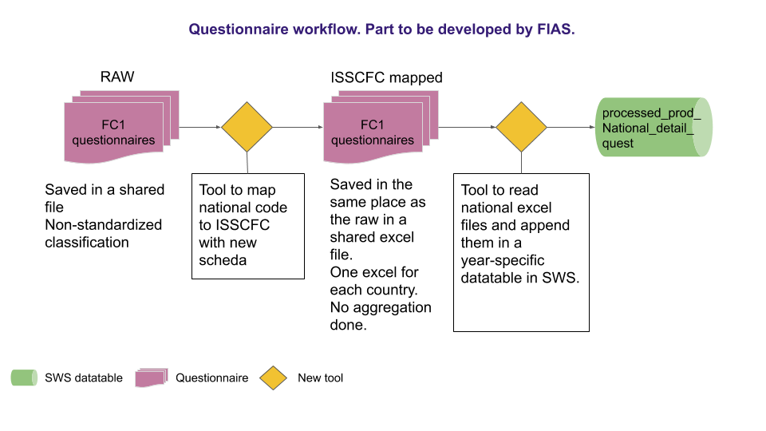
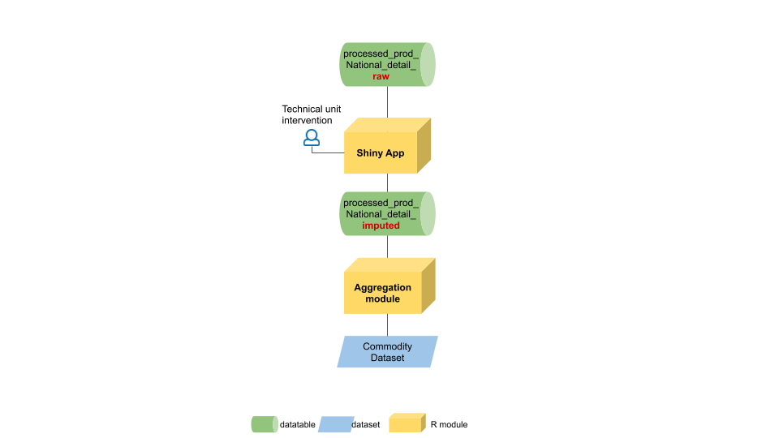

# **Processed production data workflow** {#ProcProd}

The whole workflow aims to populate the Commodity dataset that stores quantities of preserved and processed fishery and aquaculture commodities produced from domestic production and imported raw materials.
Processed production is only a part of the data populating the Commodity dataset; trade data represent the other part and, because of the data imputation process, they have to be saved in the Commodity dataset before processed production data. Specifically, in order to correctly and completely carry out processes linked to processed production, the user has to check all export data are available.
The following paragraphs describe the workflow for processed production data from data entry to data validation and chapter \@ref(Aggregation) describes the aggregation part to populate the Commodity dataset.

## **Data collection and data entry processes**

Data are collected through questionnaires sent to the countries by the FIAS unit once a year. Questionnaires contain country specific commodities classified according semi-standardized codes, national codes, often more detailed than the International Standard Statistical Classification of Fishery Commodities (ISSCFC) classification.
This means questionnaires sent out by the FIAS unit are compiled by countries with products, so that, for each ISSCFC product there could be more than one corresponding national code. Initial country data are classified according _schede_ cards having a two-fold structure divided by a dot: the first part, a number between 1 and 9, corresponding to the FAO major group and the second part formed by a 4 digit sequential number.E.g. 1.1369, where the first number of the sequential key is the FAO major group (1) and the second part (1369) is a sequential key. Every time a new code enters the database for that country a new sequential key is generated. The major FAO groups are defined by the YBKlang classification.
If a new product is reported by a country for the first time, FIAS unit assign a new scheda first identifying the FAO major group and then assigning the first available sequential code in the FAO group for the country. It is worth noting that _schede_ are country specific so the same code can correspond to different products in different country. Please note a new dimension has been proposed by the Methodological team so that products could be uniquely identified and data inserted in a dataset (and not a data table) in the SWS. These codes have been created and can be found in the '`processed_prod_national_detail_imputed`' data table in the '`measureditemnational`' column. This new dimension would avoid errors and inconsistencies that are more difficult to spot in a data table.

Once the questionnaires have been collected and _schede_ assigned to all products, processed production data are gathered and uploaded into the Statistical Working System (SWS) in the '`processed_prod_national_detail_raw`' data table. 
Figure \@ref(fig:preWF) show the process performed by FIAS unit from the questionnaire receipt until the upload in the SWS. The data are first received by FIAS unit, the missing _schede_ are assigned and data uploaded into the SWS.

```{r  preWF, echo=FALSE, out.width="100%", fig.cap=' Workflow from data colletion to data entry on SWS.'}

```


## **Data imputation and validation processes** {#shiny}

The methodology developed for processed production data imputation and validation results from a close cooperation between the FIAS unit and the ESS methodological team. The developed Shiny application mostly follows the methodology used so far by the FIAS unit with some additional feature.
The additional features mainly consist of a more detailed and documented mapping structure between the missing figure and the figures used as proxy, the introduction of a third approach based on a statistical model to impute data, and a process integrated in the SWS.

The two main approaches used, the export approach and the primary production approach, are based, respectively, on export data (stored in the Commodity dataset) and on primary production data (stored in the Global production dataset). Therefore, if data are not available for the chosen imputation year in these datasets then it will not be possible to apply either of the approaches. For this reason the imputation of trade data has to precede the one of processed production data.

The next paragraphs present the three approaches used to impute missing processed production data: *export approach*, *primary production approach* and *ensemble method approach*. In the Shiny application the user can also impute a manual value (*manual approach*) if none of the aforementioned method was satisfying or available. The method chosen by the user is recorded and stored in the '`processed_prod_national_detail_imputed`' data table ('`approach`' column). Also the flag depend on the chosen approach. 

Once raw data are in the SWS, the process of data checking, imputation and validation begins. These processes are semi-manual and are carried out through a Shiny application that provides the user a user-friendly tool to visualize time series and customize the processes.

The workflow starting from the raw data table until the final entry into the Commodity dataset is shown in figure \@ref(fig:shinyWF).

```{r  shinyWF, echo=FALSE, out.width="100%", fig.cap=' Workflow description of the Shiny application.'}

```

The workflow show two data tables that store values at the national level one for raw data and the other for all the data (imputed and not). Between the data tables a Shiny app allows for data imputation and validation. Once the imputed table is ready data at _scheda_ level are aggregated at ISSCFC level to populate the Commodity dataset.

### Export approach 

When using the export approach the main assumption is that the export of processed products is related to their production. Unless the country imports products to export them (without any transformation), the exported quantities are usually lower than the production, and regularities in the proportion of export quantities can be found for several products. The relationship between production and export of commodities have been identified by a FIAS expert who provided the mapping in the data table '`isscfc_mapping_export_approach`'. Along with the provided mapping, labelled in the data table with 'Type' value equal to '*provided*', those labelled as '*automatic*' have been automatically generated by an R routine ^[The R routine used is contained in the R file 'mappingFormatting.R' in the Share Point (<https://unfao.sharepoint.com/sites/tssws/Shared%20Documents/Forms/AllItems.aspx?viewid=07492829%2Dae8e%2D4338%2Dbc40%2D97411da985e8&id=%2Fsites%2Ftssws%2FShared%20Documents%2F03%2E%20Statistical%20Documentation%2F02%2E%20Statistical%20Processes%2F09%2E%20FIAS%2FFIAS%20%E2%80%93%20Commodities%2FDatatables%5Fuploaded%2FExport%26PrimaryProdMappings>).]. Automatic mappings have been generated only for countries having provided export mappings. 
Some of the provided mappings and all of the automatic one are one-to-one mappings, i.e. one export product  corresponds to only one production product. 
In other cases, there are one-to-many mappings, i.e. for a production product there are two or more corresponding export products. The one-to-many mappings exist because, in some cases, export information and export codes are more detailed than the production codes so that, for a same general product classified in the production part, there are several exported products with more detailed descriptions and, therefore, different codes. The mapping has been provided, at ISSCFC level and not at _scheda_ level, i.e. the data imputation level. This does not impact the approach validity as _scheda_ are uniquely linked to one ISSCFC code for one country. and the expert can change the mapping during the imputation process if needed. 

After the mapping, the second element to determine for the export approach is the ratio between processed production and export data. The ratio to apply to impute the missing production can either be based on time series or manually imputed. In the first case, the simple average ratio between the processed production and the export is used. The user chooses the time series length for the average calculation and the production is calculated by applying the average ratio to the export quantity. In the second case the user chooses the ratio according to external information and knowledge.
For the time series based ratio, let $P_t$ and $E_t$ denote respectively the production and the export volume in year $t$, with $t=1,...T$ where $T$ is the year of interest. Then the ratio for each year $t \neq T$ is $$r_t = P_t / E_t$$ and the imputed production $P_T$ is $$P_T= \bar{r} \times E_T$$ where $\bar{r}$ is the mean of ratios $r_1,...,r_{T-1}$: $\bar{r} = n^{-1} \sum_{t \neq T} r_t$ where $n$ is the length (number of years) of the time series.

The missing processed production is calculated by a simple multiplication between the mapped export quantity and the chosen ratio. The value obtained will be compared with the two other approaches (if available).

### Primary production approach

The primary production approach assumes a link between fishery processed production and primary production of a country. As with the export approach, the starting point is a mapping provided by the FIAS unit and then completed automatically by an R routine. Nevertheless, there are substantial differences between the two mappings contained in the data tables '`isscfc_mapping_export_approach`' and '`isscfc_mapping_prod_approach`'. First of all, whereas the export mapping has a link within ISSCFC codes, the link between processed and primary production is inter-dimensional: the processed production is classified according ISSCFC and the primary production is classified according ASFIS alphacode. Moreover, the connection between the ISSCFC and the ASFIS dimensions is made through the help of the International Standard Statistical Classification of Aquatic Animals and Plants (ISSCAAP) group classification. Each commodity is assigned to one or more ISSCAAP groups and, within each ISSCAAP group, either all the belonging species or only few selected ones are included in the mapping. If the mapping is labelled as 'automatic' the ISSCAAP group associated is always the one reported in the YBKlang file with all the species selected by default. If the mapping has been provided there can be more than one ISSCAAP group associated to one commodity and also selected species within the groups. 

As the primary production is often much larger than the processed production and the same primary can be used for several commodities, an additional ratio has been inserted to indicate what proportion of the mapped species has to be included in the mapping. This allows for an allocation of each species to different products avoiding the allocation of more than $100\%$ of the available quantity. By default this ratio is equal to one and it is to the expert to decide whether to change it or not. 

The remaining part of the approach follows the same structure of the export mapping. The primary production quantities selected are summed and the proportion used to calculate the missing processed production can be either based on the time series or manually chosen. 
Let $P_t$ and $S_t$ denote respectively the production and the primary production volume in year $t$, with $t=1,...T$ where $T$ is the year of interest. Then the ratio for each year $t \neq T$ is $$r_t = P_t / S_t$$ and the imputed production $P_T$ is $$P_T= \bar{r} \times S_T$$ where $\bar{r}$ is the mean of ratios $r_1,...,r_{T-1}$.  


### Ensemble method approach

The 'ensemble method' or 'ensemble learning' is briefly documented in this paragraph but an extended presentation is available in the `faoswsImputation` package along with the function used to impute variable in the Git Hub repository [SWS-Methodology](https://github.com/SWS-Methodology). 

The ensemble method builds a collection of simple models and combine them to obtain a composite model. Averaging multiple models the risk of choosing a poor model is reduced. The approach has two main steps: the building of the models and their combination. The model considered are:

  - **Mean**: Mean of all observations

  - **Median**: Median of all observations

  - **Linear**: Linear Regression

  - **Exponential**: Exponential function

  - **Logistic**: Logistic function

  - **Naive**: Linear interpolation followed by last observation carried forward and first observation carried backward.

  - **ARIMA**: Auto regressive Integrated Moving Average model selected based on the corrected Akaike's Information Criterion (AICC), and imputation via Kalman Filter.

  - **LOESS**: Local regression with linear models and model window varying based on sample size.

  - **Splines**: Cubic spline interpolation.

  - **MARS**: Multivariate Adaptive Regression Spline

  - **Mixed Model**: Linear mixed model with time as a fixed effect and country as the random effect.

All these models are then combined so that the final result is a weighted average of all the input models.

This approach is completely automatized by the R function in the aforementioned R package `faoswsImputation`. The ensemble method result value is proposed to the expert along with the two other approaches. In case no mapping or no data is available for the other approaches the ensemble method approach can be considered the default method as it is always available.

## **SWS objects and the Shiny application**

The processes described in the previous paragraphs are embedded in the SWS through dedicated objects. Specifically: *datatables*, and a *Shiny application* to perform the data imputation and validation processes.

### Datatables

Data tables have been chosen as data storage objects instead of datasets because of the semi-standardized codes contained in the questionnaires. In the SWS, data tables are more flexible than data sets and a higher number of information can be stored without restrictions. At the same time, an extra care is required for the same reason. Because the system cannot control the content, the user has to carefully check that the information inserted in the data table contains no error.

Both raw and imputed processed production data are stored in two data tables in the SWS, respectively: '`processed_prod_national_detail_raw`' and '`processed_prod_national_detail_imputed`'. The Shiny application reads from the *raw* and writes on the *imputed* data table. Once in the *imputed* data table the semi-standardized data are standardized, aggregated and included in the Commodity dataset which uses ISSCFC codes.

With the Shiny app the user performs the checking, validation and imputation process. The data tables used by the Shiny app for the processes are described below.
The '`processed_prod_National_detail_raw`' data table contains the whole time series for all countries. This implies that new data are appended every year to the same table. This way of storing data has been discussed with the technical unit and the structure of the *raw* data table has been chosen by the technical unit. The *imputed* data table copies the same structure with two additional columns (*measureditemnational* and *approach*). 

|**processed_prod_national_detail_raw**|                                                   |
|:------------------------------------:|---------------------------------------------------|
| *Dimension id*                       | *Description* |
| geographicaream49_fi | M49 standard country code |
| measuredelement | Element code (*5510* production) |
| timepointyears | Year of the data point |
| nationalquantity | Quantity of production as communicated by the country |
| nationalquantityunit | Unit of measure used by the country |
| id_isscfc | internal FIAS code for the ISSCFC |
| measureditemisscfc | ISSCFC code associated to the scheda |
| nationalcode | country 12 digits product code (if present)  |
| nationaldescription | country product description (if present) |
| remarks | FIAS notes |
| quantitymt | quantity in metric tonnes (converted if necessary from *nationalquantity*)|
| flagobservationstatus | SDMX observation flag |
| flagmethod | SDMX method flag |
| id_nationalcode | scheda code |


The '`processed_prod_National_detail_imputed`' data table replicates the same structure of the *raw* data table with two additional columns (*measureditemnational* and *approach*):

|**processed_prod_national_detail_imputed**| |
|:----:|--------|
| *Dimension id* | *Description* |
| measureditemnational | An *ad-hoc* dimension to uniquely define the _schede_ |
| approach | Approach used for the imputation |

The data tables used for the export and primary production approaches have the following structure:

|**isscfc_mapping_export_approach**| |
|:----:|-----|
| *Dimension id* | *Description* |
| geographic_area_m49_fi | M49 standard country code |
| start_year | Mapping validity start year |
| end_year | Mapping validity end year |
| measured_item_isscfc | Production ISSCFC code |
| measured_item_isscfc_exp | Export ISSCFC code |
| selection | Export element included or not in the mapping |
| type | If mapping is automatic or provided by FIAS unit |

|**isscfc_mapping_prod_approach**|                                                    |
|:-------------------------------:|---------------------------------------------------|
| *Dimension id* | *Description* |
| geographic_area_m49_fi | M49 standard country code |
| start_year | Mapping validity start year |
| end_year | Mapping validity end year |
| measured_item_isscfc | Product ISSCFC code |
| isscaap | ISSCAAP group linked to the product |
|asfis | Asfis species in the ISSCAAP group (listed or 'all') |
| ratio| The proportion of the species production to use for the commodity imputation |
| selection | Species included or not in the mapping |
| type |  If mapping is automatic or provided by FIAS unit |

The next two data tables are temporarly used to map species and commodities to the correspondent ISSCAAP group. Once the SWS and the EBX5 (Data management software) will be integrated and communicate effectively, these data tables should be replaced by the direct pull of the information from EBX5.
Meanwhile, these data tables should be updated in case new species or commodities are included.

|**map_asfis**| |
|:-------------------------------:|---------------------------------------------------|
| *Dimension id* | *Description* |
|ics | International Classification for Standards for fishery products|
|isscaap | International Standard Statistical Classification for Aquatic Animals and Plants group|
| asfis | List of Species for Fishery Statistics Purposes |
| description | English name of the species |

|**fishery_item_mapping**| |
|:-------------------------------:|---------------------------------------------------|
| *Dimension id* | *Description* |
| isscaap|  International Standard Statistical Classification for Aquatic Animals and Plants group|
|isscfc |FAO International Standard Statistical Classification of Fishery Commodities|
|ics | International Classification for Standards for fishery products |
|conversion_factors | factors to convert the commodity in weight primary equivalent|

## **Application goal and structure**

The application is based on `shiny` R package and provides tools to visualize, check and impute fishery commodities production data. Briefly summarizing, the application proposes four different imputation options: ensemble model based approach, exports based approach, primary production based approach and the possibility to insert a manual imputation. 
The user can customize the three last approaches, whereas the ensemble model based approach is directly provided by the application using an internal R function. The imputation is performed by country, year and commodity. 

As starting point the user sets these parameters from the interactive menu on the left side and visualize data accordingly.
Once the user has compared the different approaches and chosen the value to impute a validation button is available to impute the value directly in the *imputed* data table in the SWS (`processed_prod_national_detail_imputed`).

The application has six working tabs, all sharing the same side menu where the user select data, plus an 'About' tab.
The tab names are: 'National mapping', 'Export approach', 'Primary Prod. approach', 'Summary', 'Check export approach mapping', 'Check prod approach mapping' and 'About'.

The side menu has six fields to help the user select the data:

a. **Country**: with this button the user selects the country to analyze. The list includes all the countries in the M49 classification code list. Both the country name and code are shown and the user can look for the country taping either of them. If there are no data for the country selected the user would not be able to select anything else and a message will appear suggesting to choose another country, e.g. figure  \@ref(fig:nocountry).

```{r  nocountry, echo=FALSE, out.width="100%", fig.cap=' Shiny application message when no data is available for the requested country.'}
knitr::include_graphics("img/Shiny1c.png")
```

b. **Imputation year**: the user can select the year of interest for the imputation. The years listed are those present in the '`processed_prod_national_detail_raw`' data table for the chosen country, sorted in descending order.

c. **Starting year**: it is the year the user wants to check the time series from. This choice has mainly visualization purpose but it also affects the average ratio value in the export and primary production approaches. Changes in the mapping only affect data from imputation year onward and imputations is made only for the chosen imputation year. If for the export or primary production approach there are no data available to impute processed production, a message appears showing what years are available within the chosen period. For example, if the chosen period is 2010-2017 and data are missing for years 2012-2017 the app returns a message saying that the years available are only 2010 and 2011 see figure \@ref(fig:noyear). 
By default, the first year available is the year before the previously selected imputation year.

```{r  noyear, echo=FALSE, out.width="100%", fig.cap=' Shiny application message when only few of the requested years are available.'}
knitr::include_graphics("img/ShinyNoYearAv.png")
```

d. **Missing**: This button filters the commodities displayed in the last field (Commodity) and it has three options: "Yes", "No" and "Not to impute". If the user selects "Yes" then the commodities shown are commodities with missing data that have to be imputed. These data do not appear in the '`processed_prod_national_detail_raw`' data table but they are created in the '`processed_prod_national_detail_imputed`' data table with value $0$ and flags (M, u) with a specific R function. Please note that this flag is the one used by the system to identify and impute missing data. Flags change once imputation is validated. 
The missing data to be imputed are identified by an internal function that analyses the information contained in the time series. If the series contains only zeros and missing values flagged as (M,-) or (O,-) then it is considered to contain no information for imputation. Otherwise, if information is available, the cell can be imputed and it is included in the list of missing values to impute with flags (M, u). 
The option "No" filters all the commodities with non missing figures, i.e. with an observation status flag different from 'M' or 'O'. These data do not need imputation, nevertheless, the user can still review these data and assign a different value if necessary. 
The third option "Not to impute" has been introduced for the user to see all the series with flags (M, -) or (O, -) meaning that the series is either not active anymore or the datum selected is missing and is not to impute. As in the previous case, the user can still perform imputation and validation steps if necessary.

e. Commodity: last filter listing commodities corresponding to the previous choices. Even if the imputation is at national commodity level, along with the _scheda_ code, the list also shows the ISSCFC code and label associated to the scheda.  

Once inputs are chosen, they should remain the same during the whole procedure to ensure consistency and avoid errors. Nevertheless, the user can change the input at any time. If a filter changes, the filters following the changed one will have to be selected again. Figure \@ref(fig:firsttab) shows the Shiny app after all inputs have been fixed along with the first table appearing in the first tab.

```{r  firsttab, echo=FALSE, out.width="100%", fig.cap=' Shiny application, first tab showing the imputed processed production datatable.'}
knitr::include_graphics("img/Shiny1b.png")
```

### National mapping tab

In this first tab the user visualizes the imputed data table *processed_prod_national_detail_imputed* as it is in the SWS. In this way all commodities for the period selected can be checked along with the approach used for the previously imputed values.
This table cannot be modified and only has consultation purpose.

The button 'Check new items' performs the following checks on the imputed table:

a. If a new commodity has appeared since the last update it shows the message 'A new commodity has appeared in the processed production table since last update. Commodity: ...'

b. If a new scheda has appeared since the last update it shows the message 'A new Scheda has appeared in the processed production table since last update. Commodity: ...'

If no new product has appeared in the updating process of the data table then the message is 'No new commodity or scheda has appeared since last update.'.

### Export approach tab

The imputation approach based on export data assumes the proportion between export and production of a commodity is, on average, stable over time for each country. The missing processed production is calculated multiplying the export data by the average ratio between the produced and exported quantity of the chosen commodity during the period selected. The kind of ratio applied depends on the choice of the light blue buttons in the center of the page and the possibility to insert a manual ratio appears in a separate box when choosing the option 'Manual ratio' in the light blue buttons. Ratio button choices: 'Original data', 'Average ratio', 'Manual ratio'. As export data are sometimes more detailed than production ones, a mapping relating ISSCFC codes for commodity production to ISSCFC codes for commodity export has been created. The mapping is of the form one (production code) to one or many (export codes) and can be updated in the export approach tab through the first table appearing on the top of the page.
Once the user is satisfied with the new mapping, the initial mapping can be updated with the button 'Update mapping'. The effect of this update on the mapping can be checked on the 'Check mapping export approach' tab and then transferred to the data table in the SWS.
The processed production value computed is shown in the red bordered cells in the second tables in the export approach tab and will be displayed in the summary tab where the user can compare it with values deriving from other approaches.
The whole page displayed for the export approach tab is shown in figure \@ref(fig:exp1).

```{r  exp1, echo=FALSE, out.width="100%", fig.cap=' Shiny application, whole export approach tab.'}
knitr::include_graphics("img/Shiny2a.png")
```

**Tab elements:**

The 'Export approach' tab shows two tables, a graph, a 'Check mapping', an 'Update mapping' and a 'Ratio choice' button. 

The upper table has twelve columns:

1. 'Selection': with this column the user can change the mapping. Checking and unchecking the exported commodities they are included or excluded from the processed production calculation.

2. 'type': it refers to the type of mapping of the row. If the mapping has been 'provided' by the FIAS unit or if it has been created automatically by matching commodities with the same code in production and export.

3. 'description': the name of the exported commodity in the row (names are those contained in the SWS reference list).

4. 'measuredItemISSCFC_exp': ISSCFC codes referring to the export commodity mapped to the ISSCFC production code.

5. 'Value_exp': value in tonnes of the exported commodity.

6. 'flagObservationStatus_exp': SDMX observation status flag of the export data

7. 'flagMethod_exp': SDMX method flag of the export data

8. 'timePointYears': the imputation year.

9. 'nationaldescription': description provided by the country for the commodity to impute (taken from the data table with raw data).

10. 'remarks': remarks provided by the country or inserted by the FIAS unit for the commodity to impute (taken from the data table with raw data).

11. 'Scheda': the code associated to the national commodity to impute.

12. 'measuredItemISSCFC': ISSCFC code referring to the Scheda

Modifying this table the user can change the mapping previously in use. The user can add, remove, check or uncheck rows. In general it is recommended not to remove rows but only to uncheck unnecessary mappings so that unchecked rows can always be reintroduced and evidence of the old mapping is kept in the table the user visualizes.
Once the user is satisfied with the changes the mapping can be updated clicking on the button 'Update mapping'. Changes in the mapping can be visualized in the 'Check mapping export approach' tab.
In order to update the mapping only the type, export commodity and commodity cell should be compiled. The other information is retrieved automatically. The only fields kept in memory and updated are those also appearing in the mapping table provided by the FIAS unit and appearing in the SWS, i.e. measuredItemISSCFC, measuredItemISSCFC_exp, type and Selection. Country, start year and end year are automatically assigned.

Note that the application only updates the mapping if the 'Update' button is pressed. After updating the mapping the user can revise the final mappings in the tabs 'Check export approach mapping' and 'Check prod approach mapping'. If the user is satisfied with the mappings then to apply the changes to the data table in the SWS the button 'Save mapping in SWS' has to be pressed. These two steps ensure that all changes are consistent with the user's choices. This also applies to the primary production mapping update.

When the user updates the mapping its consistency can be checked clicking the button 'Check mapping'. It is advisable to perform this operation before starting any activity and regularly after few updates.

Clicking the button the following checks are performed:

a. If there is more than one mapping for the same commodity which has 'LAST' as end year. This is an inconsistency as it means that there are two periods in the data table for the same mapping. The Shiny should warn the user if something similar is happening when updating the mapping. Message: 'INCONSISTENCY! The chosen commodity has two start years for the same end year (LAST). Please check in the SWS mapping data table.'  

b. If the imputation year is older than the current mapping, i.e. the mapping has already changed since the year the user wants to impute, this could cause an inconsistency in the mapping. Therefore, the Shiny app returns the message: 'The mapping has already changed since the chosen imputation year. Please update the mapping manually coherently to avoid automatic errors.' The user can then manually change the mapping possibly correcting for retroactive changes.
                
c. If the same exported commodity has been allocated twice, i.e. there is a duplication in the mapping for the last period, then the app returns the message: 'The mapping implies a duplication. Please check commodity(ies): ...'.
                                            
d. If a new commodity appears in the national production list which is not included in the mapping the the message shown is 'The following items have production figures but are not included in the export approach mapping table: ...' 

e. Linked to the previous point, if the export quantity corresponding to the new commodity appearing in the production list is linked to another commodity for the same country the message appearing is 'The following commodity(ies) have export quantities linked to another commodity code in the mapping table: ...'

f. If a commodity, which is in the mapping as an export commodity, has not been allocated the message is: 'The following commodity(ies) have not been included in the mapping: ...'.

g. If mapping validity periods overlap, e.g. if mapping for a commodity X has two mappings, one for period 1 and one for period 2 where: start_year1 = 1948, end_year1 = 2015 and start_year2 = 2012, end_year2 = 'LAST', because the two periods overlap for years 2012-2015 the message shown is: 'This current mapping implies an inconsistent allocation. Two validity periods overlap for commodity(ies): ...'.
      
If no inconsistency is found then the button returns the message 'The current mapping is consistent.'

These messages do not prevent the user from proceeding. They only appear if the user presses the 'Check mapping' button. Conversely, there are cases when either the approach is not applicable or there is a clear error in what has been inserted by the user. In these cases the app shows messages the user has to address before continuing any activity. 
These messages are:

a. 'Export approach not applicable. No available mapping for the chosen country.': if there is no available mapping for the chosen country.

b. 'Export approach not applicable. No available export value for the chosen input combination.': if there is no export value associated to the chosen commodity.

c. 'Export data for the time range and commodity selected are not available. Years available: ...': if no export data is available for the time range selected. In this case the app shows (within the chosen time range) the years available for which the approach is applicable.

d. 'Export approach not applicable. Calculations for this commodity cannot be performed.': if for any reason the calculations required cannot be performed. If this message appears, please contact the person in charge of the code as it likely an error that needs to be fixed in the code and does not depend on the user.

e. 'The commodity inserted in the measuredItemISSCFC column is not in the commodity list. ... is not a valid code.': all the code inserted in the mapping table have to be in the commodity list used in the SWS, if the commodity inserted does not belong to this list either there is an error in the inserted code or the list of commodities in SWS has to be updated.

f. 'The commodity inserted in the measuredItemISSCFC_exp column is not in the commodity list. ... is not a valid code.': same as the previous one but for the export commodities.

Figure \@ref(fig:exp2) shows the upper part of the export approach tab with two unselected commodities.

```{r  exp2, echo=FALSE, out.width="100%", fig.cap=' Shiny application, upper part of export approach tab.'}
knitr::include_graphics("img/Shiny2b.png")
```

As the user changes the mapping the consequences of the change are visible in the table and the graph below in the page.

The second table in the tab has three rows: processed production volume, export volume and ratio row. The time series for these data is shown for all the selected period (start year - imputation year). The processed production row shows beside each value the associated flag; the export row shows the sum of all the commodities in the mapping (if more than one) and the aggregated flag associated; the ratio row shows the ratio between the processed production and the export volumes for each year. The last column contains the average values calculated for the selected years but the imputation year.
The table is dynamic and changes according to the mapping but changes only affect the imputation year.
What happens in the table is graphically shown in the plot below the table displaying time series for export and processed production volumes (in tonnes).
The user can choose what ratio to apply to calculate the processed production estimate. By default the original data is shown (if available), if data are missing the average ratio is used. If the user wants a manual ratio can be inserted clicking on the button 'Manual ratio'.
Figure \@ref(fig:exp3) shows the lower part of the export approach tab.

```{r  exp3, echo=FALSE, out.width="100%", fig.cap=' Shiny application, lower part of export approach tab.'}
knitr::include_graphics("img/Shiny2c.png")
```


### Primary Prod. approach tab

The approach based on primary production uses the data in the 'Global production' dataset (union between Capture and Aquaculture productions) classified according to ASFIS alphacodes.
The connection between species and commodities is based on ISSCAAP groups. The mapping for the primary production approach connects each commodity to one or more ISSCAAP groups and, within each ISSCAAP group, to either a list or to all the species belonging to the groups. Since each ISSCAAP group and each species can be associated to more than one commodity, it is possible for the user to set the ratio (or share) of each species to allocate to the commodity. In this way the production can be split across different commodities. By default the ratio is set to 1.

As in the export approach, the missing processed production is calculated multiplying the primary production mapped to the commodity of the chosen imputation year by the average ratio between the processed and primary production of the chosen commodity during the period selected. Also in this case, there is the possibility to insert a manual ratio changing the ratio choice with the light blue buttons. Choices: 'Original data', 'Average ratio', 'Manual ratio'.
By default in the tab all the species produced in the selected country are shown (even if production in the selected year is zero). Then the user can check (uncheck) species to include (exclude) from the mapping, or just change the ratio/share of species to be associated to the commodity.

Once the user is satisfied with the new mapping, the initial mapping can be updated with the button 'Update mapping'. The effect of this update on the mapping can be checked on the 'Check mapping prod approach' tab and then transferred to the data table in the SWS.
The processed production value computed is shown in the red bordered cells in the second tables in the Primary Prod. approach tab and will be displayed in the summary tab where the user can compare it with values deriving from other approaches.
The whole page displayed for the primary production approach tab is shown in figure \@ref(fig:pp1).

```{r  pp1, echo=FALSE, out.width="100%", fig.cap=' Shiny application, whole primary production approach tab.'}
knitr::include_graphics("img/Shiny3a.png")
```

**Tab elements:**

The 'Primary Prod. approach' tab shows two tables, a graph, a 'Check mapping', an 'Update mapping' and a 'Ratio choice' button.

The first table has fourteen columns: 

1. 'Selection': with this column the user can change the mapping. Checking and unchecking species they are included or excluded from the processed production calculation.

2. 'type': it refers to the type of mapping of the row. If the mapping has been 'provided' by the FIAS unit or if it has been created automatically by matching commodities with the same code in production and export.

3. 'Ratio': it is the share of production for the species to be mapped to the commodity, so the same species can be mapped to more than one commodity avoiding allocating for more than 100% of the production.

4. 'isscaap': the ISSCAAP group corresponding to the species.

5. 'description': the English name of the species in the row (names are those contained in the SWS reference list).

6. 'frisheriesAsfis': ASFIS alphacode referring to the species.

7. 'Value_PrimaryProd': value in tonnes produced for the species.

8. 'flagObservationStatus_PrimaryProd':  SDMX observation status flag of the primary production value.

9. 'flagMethod_PrimaryProd':  SDMX method flag of the primary production value.

10. 'timePointYears': the imputation year.

11. 'nationaldescription': description provided by the country for the commodity to impute (taken from the data table with raw data).

12. 'remarks': remarks provided by the country or inserted by the FIAS unit for the commodity to impute (taken from the data table with raw data).

13. 'Scheda': the code associated to the national commodity to impute.

14. 'measuredItemISSCFC': ISSCFC code referring to the Scheda

Modifying this table the user can change the mapping previously in use. The user can add, remove, check or uncheck rows. In general, it is recommended not to remove rows but only to uncheck unnecessary mappings so that unchecked rows can always be reintroduced and evidence of the old mapping is kept in the table the user visualizes.
Once the user is satisfied with the changes in the mapping the mapping can be updated clicking on the button 'Update mapping'. Changes in the mapping can be visualized in the 'Check mapping prod approach' tab. 
In order to update the mapping only the type, species, ISSCAAP and commodity cells have to be compiled. The other information is retrieved automatically. Please note that the only fields modifiable are those also appearing in the mapping table provided by the FIAS unit and in the SWS, i.e. fisheriesAsfis, isscaap, measuredItemISSCFC, type and Selection. Country, start year and end year are automatically assigned.

When the user updates the mapping its consistency can be checked clicking the button 'Check mapping'. It is advisable to perform this operation before starting any activity and regularly after few updates.

Clicking the button the following checks are performed (please note that checks a, b and d are the same as for the export approach):

a. If there is more than one mapping which has 'LAST' as end year. This is an inconsistency, as it means that there are two periods in the data table for the same mapping. The Shiny warns the user if something similar happens when updating the mapping. Message: 'INCONSISTENCY! The chosen commodity has two start years for the same end year (LAST). Please check in the SWS mapping data table.'  

b. If the imputation year is older than the current mapping, i.e. the mapping has already changed since the year the user wants to impute, this could cause an inconsistency in the mapping. Therefore, the Shiny app returns the message: 'The mapping has already changed since the chosen imputation year. Please update the mapping manually coherently to avoid automatic errors.' The user can then manually change the mapping possibly correcting for retroactive changes.
  
c. If the same ISSCAAP group is mapped to more than one commodity this is notified by the message: 'ISSCAAP group(s) ... is (are) mapped to more than one commodity for this country.' 

d. If a new commodity appears in the national production list which is not included in the mapping the message shown is 'The following items have production figures but are not included in the export approach mapping table: ...'.

e. If more than 100% of the primary production for one species has been allocated, then the app returns the message 'More than 100% of the available primary production has been allocated for species ...'

If no inconsistency is found, then the button returns the message 'The current mapping is consistent.'

As in the export approach, these messages do not prevent the user from proceeding. 
The messages the user has to address before continuing any activity are:

a. If there is no primary production approach mapping provided for the whole country 'Primary production approach not applicable. No available mapping for the chosen country.'.

b. If no data is available for the chosen parameters: 'Primary production data for the country, time range and commodity selected are not available. Please select different inputs or ignore this approach.'

c. When modifying the mapping table in the tab, if a commodity code is not valid, or it is NA then the following message appears: 'One of the commodity inserted in the measuredItemISSCFC column is not in the commodity list. ... is not a valid code.'

d. As in point 'c', the same happens if the species inserted is not valid.

e. Along with the new species, also ISSCAAP group is a necessary information when adding a mapping in the table so if not inserted the app asks for it: 'Please enter Isscaap group for species ...'

f. If the ISSCAAP group inserted is not the one appearing in the data table used for mapping then the message 'Please assign species to the right ISSCAAP group(s).' is returned.

Figure \@ref(fig:pp2) shows the upper part of the export approach tab.

```{r  pp2, echo=FALSE, out.width="100%", fig.cap=' Shiny application, upper part of primary production approach tab.'}
knitr::include_graphics("img/Shiny3b.png")
```

The second table has the same structure as the second table in the 'Export approach' tab but, instead of the exports volume, the primary production volume is shown. 
Figure \@ref(fig:pp3) shows the lower part of the export approach tab with the manual ratio choice.

```{r  pp3, echo=FALSE, out.width="100%", fig.cap=' Shiny application, lower part of primary production approach tab.'}
knitr::include_graphics("img/Shiny3c.png")
```

### Summary and  check mappings tabs

The 'Summary' tab contains results from the two previous approaches, it proposes a value calculated using the ensemble method approach ^[Statistical Working Paper on Imputation Methodology for the FAOSTAT Production Domain. Joshua M. Browning, Michael C. J. Kao, Francesca Rosa. Food and Agriculture Organization of the United Nations.] and, in addition, the possibility to insert a manual input and the original data (if available). The user can see the values in the plot, along with the time series since the start year selected, and choose which value to impute in the dataset. Once the user has selected the approach, the imputation and the dataset update is performed clicking on the 'Impute value' button and the data table *processed_prod_national_detail_imputed* is automatically updated.

Figure \@ref(fig:summ1) shows the summary approach tab.

```{r  summ1, echo=FALSE, out.width="100%", fig.cap=' Shiny application, summary tab.'}
knitr::include_graphics("img/ShinySumm.png")
```

The two last tabs are checking tabs where the user can see the result of the mapping updates performed in the export and primary production tabs. This last step is necessary to ensure errors in the updates or unwanted updates are saved into the SWS and used for the next imputations. The tables shown in the app exactly reproduce the data tables stored in the SWS and can be seen in figures \@ref(fig:cME) and \@ref(fig:cMP).

```{r  cME, echo=FALSE, out.width="100%", fig.cap=' Shiny application, Check mapping export approach tab.'}
knitr::include_graphics("img/ShinyExpMap.png")
```

```{r  cMP, echo=FALSE, out.width="100%", fig.cap=' Shiny application, Check mapping prod approach tab.'}
knitr::include_graphics("img/ShinyPpMap.png")
```


